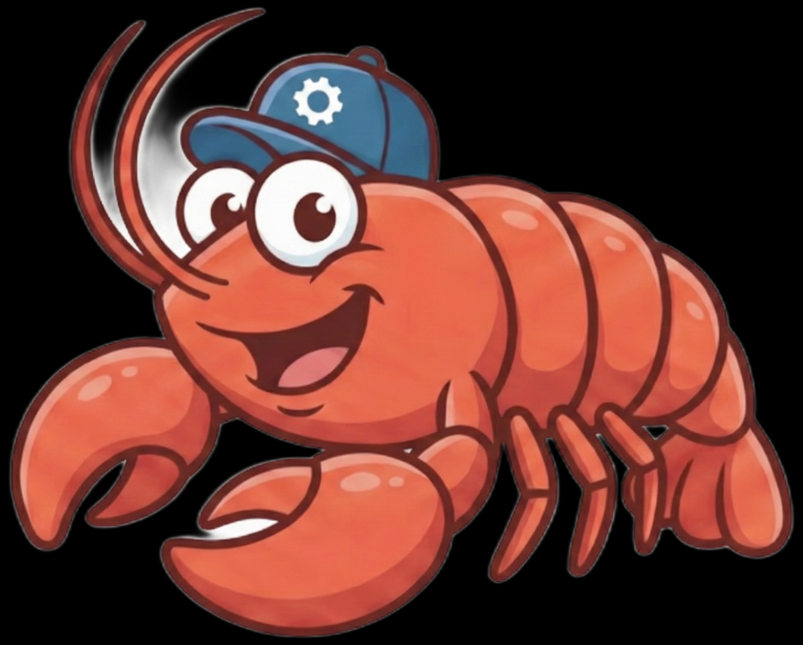

<p align="center">
  
</p>

<h1 align="center">MyLobster++</h1>

<p align="center">
  A high-performance AI assistant platform built in C++23
</p>

<p align="center">
  <a href="#usage">Usage</a> &middot;
  <a href="#building">Building</a> &middot;
  <a href="#architecture">Architecture</a> &middot;
  <a href="#comparison-with-openclaw-typescript">Comparison</a> &middot;
  <a href="#why-a-native-port">Why Native</a> &middot;
  <a href="#testing">Testing</a> &middot;
  <a href="#license">License</a>
</p>

---

## Overview

MyLobster++ is a C++23 port of the [OpenClaw](https://github.com/openclaw/openclaw) AI assistant platform. It provides the same core capabilities — multi-provider LLM integration, browser automation, memory/RAG, multi-channel messaging, plugin extensibility, and cron scheduling — compiled to a single native binary with no runtime dependencies.

The project uses Boost.Beast/Asio for async HTTP and WebSocket serving, and leverages modern C++ features like `std::expected`, coroutines, and structured bindings throughout.

## Usage

MyLobster++ is a CLI application with four subcommands:

### `gateway` — Start the AI gateway server

The primary command. Launches the HTTP + WebSocket gateway that clients connect to for AI-powered conversations.

```bash
# Start with defaults (port 18789, loopback only)
mylobsterpp gateway

# Custom port, bind to all interfaces
mylobsterpp gateway --port 8080 --bind all

# With a configuration file
mylobsterpp -c config.json gateway
```

| Flag | Env Var | Description |
|------|---------|-------------|
| `-p, --port` | `OPENCLAW_PORT` | Listen port (default: 18789) |
| `-b, --bind` | `OPENCLAW_BIND` | Bind mode: `loopback` or `all` |

The gateway accepts WebSocket connections, authenticates clients via JWT or token, routes messages through the configured LLM provider, and streams responses back. It manages sessions, memory, browser tools, channels, plugins, and cron jobs — all within a single async event loop.

### `config` — Inspect or validate configuration

```bash
# Print the current configuration as JSON
mylobsterpp config

# Validate a specific config file without printing
mylobsterpp config --validate --file /path/to/config.json

# Inspect a config file
mylobsterpp config -f config.json
```

| Flag | Description |
|------|-------------|
| `--validate` | Check if configuration is valid without printing |
| `-f, --file` | Path to a configuration file to inspect |

### `version` — Print build information

```bash
mylobsterpp version
```

Outputs the version string, C++ standard, compiler, and platform:

```
openclaw 0.1.0-dev
C++ standard: 202302
Compiler: clang 17.0.0
Platform: macOS
```

### `status` — Check a running gateway

```bash
# Check the local gateway
mylobsterpp status

# Check a remote gateway
mylobsterpp status --host 192.168.1.100 --port 8080
```

| Flag | Description |
|------|-------------|
| `-H, --host` | Gateway host (default: `127.0.0.1`) |
| `-p, --port` | Gateway port (default: from config) |

Reports connection status, configured providers, channels, plugins, and whether cron is enabled.

### Global Options

These apply to all subcommands:

| Flag | Env Var | Description |
|------|---------|-------------|
| `-c, --config` | `OPENCLAW_CONFIG` | Path to JSON configuration file |
| `--log-level` | `OPENCLAW_LOG_LEVEL` | Log level: `trace`, `debug`, `info`, `warn`, `error`, `critical` (default: `info`) |
| `--version` | | Print version and exit |

### Configuration

MyLobster++ is configured via a JSON file or environment variables. The configuration covers:

```json
{
  "gateway": { "port": 18789, "bind": "loopback", "max_connections": 100 },
  "providers": [{ "name": "anthropic", "api_key": "sk-...", "model": "claude-sonnet-4-20250514" }],
  "channels": [{ "type": "telegram", "enabled": true, "settings": {} }],
  "memory": { "enabled": true, "store": "sqlite_vec", "similarity_threshold": 0.7 },
  "browser": { "enabled": false, "pool_size": 2, "timeout_ms": 30000 },
  "sessions": { "store": "sqlite", "ttl_seconds": 86400 },
  "plugins": [],
  "cron": { "enabled": false },
  "log_level": "info"
}
```

## Building

### Prerequisites

- C++23 compatible compiler (GCC 13+, Clang 17+, or Apple Clang 15+)
- CMake 3.25+
- OpenSSL
- libcurl
- pthreads

All other dependencies are fetched automatically via CMake `FetchContent`.

### Build

```bash
cmake -B build -DCMAKE_BUILD_TYPE=Release
cmake --build build
```

The resulting binary is `build/mylobsterpp`.

### Build Options

| Option | Default | Description |
|--------|---------|-------------|
| `OPENCLAW_BUILD_TESTS` | `ON` | Build the test suite |
| `OPENCLAW_ENABLE_SANITIZERS` | `OFF` | Enable AddressSanitizer and UBSan |

```bash
# Debug build with sanitizers
cmake -B build -DCMAKE_BUILD_TYPE=Debug -DOPENCLAW_ENABLE_SANITIZERS=ON
cmake --build build
```

### Install

```bash
cmake --install build --prefix /usr/local
```

## Architecture

```
src/
├── core/        # Error types (std::expected), config, logging, utilities
├── gateway/     # HTTP + WebSocket server (Boost.Beast/Asio coroutines)
├── agent/       # Tool registry, thinking engine, runtime
├── providers/   # LLM providers (Anthropic, OpenAI, Gemini, Bedrock, HuggingFace, Ollama, Synthetic)
├── channels/    # Messaging (Telegram, Discord, Slack, WhatsApp, Signal, LINE)
├── memory/      # Embeddings, vector store (SQLite-vec), semantic search
├── browser/     # CDP client, browser pool, page actions, snapshots
├── sessions/    # Session management and persistence
├── plugins/     # Plugin SDK and dynamic loader
├── routing/     # Request routing rules
├── cron/        # Cron expression parser and scheduler
├── infra/       # JWT, HTTP client, dotenv, device info, paths, delivery queue, SSRF guard
└── cli/         # CLI entry point and subcommands (CLI11)
```

### Key Dependencies

| Library | Version | Purpose |
|---------|---------|---------|
| Boost (Beast/Asio/JSON) | 1.87.0 | Async HTTP/WS server, JSON parsing |
| nlohmann/json | 3.11.3 | JSON serialization |
| spdlog | 1.14.1 | Logging |
| CLI11 | 2.4.2 | Command-line parsing |
| SQLiteCpp | 3.3.2 | SQLite database access |
| jwt-cpp | 0.7.0 | JWT authentication |
| cpp-httplib | 0.18.3 | HTTP client |
| yaml-cpp | 0.9.0 | YAML config parsing |
| stduuid | 1.2.3 | UUID generation |
| Catch2 | 3.7.1 | Test framework |

## Comparison with OpenClaw (TypeScript)

MyLobster++ is a native port of the [OpenClaw](https://github.com/openclaw/openclaw) TypeScript/Node.js platform. The table below compares the two implementations:

| Aspect | OpenClaw (TypeScript) | MyLobster++ (C++23) |
|--------|----------------------|---------------------|
| **Runtime** | Node.js 22+ | None (native binary) |
| **Package manager** | pnpm | CMake FetchContent |
| **Binary size** | ~300 MB (node_modules + runtime) | Single static binary |
| **Startup time** | Seconds (JIT warmup) | Instant |
| **Memory footprint** | ~100-200 MB baseline (V8 heap) | ~10-20 MB baseline |
| **Async model** | Node.js event loop (libuv) | Boost.Asio io_context + C++20 coroutines |
| **HTTP/WS server** | Express + ws | Boost.Beast |
| **CLI framework** | Custom subcli system (30+ subcommands) | CLI11 (4 subcommands) |
| **LLM providers** | Anthropic, OpenAI, Google, GitHub Copilot, Qwen | Anthropic, OpenAI, Gemini, Bedrock, Hugging Face, Ollama, Synthetic |
| **Channels** | 12+ (Telegram, Discord, Slack, WhatsApp, Signal, LINE, iMessage, Teams, Matrix, WebChat, etc.) | 6 (Telegram, Discord, Slack, WhatsApp, Signal, LINE) |
| **Memory/RAG** | SQLite-vec, multiple embedding providers | SQLite-vec, embedding provider chain |
| **Browser** | Playwright-based | CDP (Chrome DevTools Protocol) direct |
| **Plugin system** | JS/TS plugins, hot-reload | Dynamic shared library loading |
| **UI** | Web UI, TUI (Ink/React), macOS menu bar app | CLI only |
| **Config format** | YAML + env vars + wizard onboarding | JSON + env vars |
| **Test framework** | Vitest | Catch2 |

### What OpenClaw has that MyLobster++ doesn't (yet)

OpenClaw is a mature platform with 71+ source directories and features accumulated over years of development:

- **Onboarding wizard** — Guided interactive setup for first-time users
- **Web UI / TUI** — Browser-based control panel and terminal UI (Ink/React)
- **Companion apps** — macOS menu bar app, iOS/Android node hosts
- **Live Canvas** — Agent-driven visual workspace
- **Voice mode** — Wake word detection and speech-to-text
- **Media understanding** — Image, video, and audio analysis
- **Link understanding** — URL content extraction and analysis
- **190+ tool commands** — Extensive built-in tool library
- **Multi-agent routing** — Route channels/accounts to isolated agent instances
- **Device pairing** — Pair mobile devices as remote nodes
- **DNS, webhooks, security hardening** — Production infrastructure tooling

### What MyLobster++ brings to the table

- **Zero-dependency deployment** — Single binary, no Node.js, no `node_modules`
- **Predictable performance** — No GC pauses, no JIT warmup, deterministic memory usage
- **Low resource usage** — Suitable for constrained environments (embedded, edge, small VPS)
- **C/C++ interop** — Can be linked directly into C/C++ applications as a static library (`openclaw_lib`)
- **Coroutine-based concurrency** — C++20 coroutines with Boost.Asio for structured async without callback hell

## Why a Native Port?

The TypeScript OpenClaw is an excellent platform, but Node.js introduces constraints that make it difficult to embed into native applications:

1. **Embedding in Rust/C/C++ apps** — The sister project [MyLobster](../mylobster/) is a Rust port of the same platform. Having both C++ and Rust native implementations means the AI agent can be linked directly into desktop applications (egui/Rust, Qt/C++), mobile apps, system daemons, or IoT devices — without bundling a 50 MB Node.js runtime and managing a child process.

2. **Static linking** — MyLobster++ builds as a static library (`openclaw_lib`) that Rust applications can consume via FFI (`extern "C"` wrappers or [cxx](https://cxx.rs/)). This makes it trivial to embed the full AI gateway inside a Rust binary:

   ```rust
   // Example: calling MyLobster++ from Rust via FFI
   extern "C" {
       fn openclaw_gateway_start(config_json: *const c_char) -> c_int;
       fn openclaw_gateway_stop() -> c_int;
   }
   ```

3. **Resource-constrained targets** — A 10 MB native binary with 20 MB runtime memory is viable on a $5/month VPS, a Raspberry Pi, or an embedded device. Node.js is not.

4. **Predictable latency** — For real-time applications (voice assistants, robotics, game NPCs), GC pauses and JIT compilation stalls are unacceptable. Native code provides deterministic response times.

5. **Distribution** — Ship a single binary. No `npm install`, no `node_modules`, no version conflicts, no postinstall scripts. Copy the binary and run it.

The Rust port (`mylobster/`) and the C++ port (`mylobsterpp/`) serve complementary roles: the Rust version integrates naturally with the Rust desktop clients (Windows, Linux, macOS via egui), while the C++ version targets performance-critical scenarios and platforms where C++ is the native language (Qt applications, game engines, embedded systems).

## Testing

Tests use [Catch2](https://github.com/catchorg/Catch2) and cover all major subsystems:

```bash
cmake --build build
cd build && ctest --output-on-failure
```

Test modules:

- `core/` — config parsing, `${VAR}` env ref resolution, error types, utilities
- `gateway/` — protocol handling, frame encoding, auth, tool policy
- `channels/` — Discord voice/presence/autothread, Telegram voice/menu, channel registry
- `agent/` — tool registry, pre-prompt diagnostics
- `providers/` — HuggingFace catalog, Ollama NDJSON, Synthetic catalog, provider interface
- `sessions/` — session lifecycle, agentId support, store
- `routing/` — binding-scope rules (peer, guild, team, global)
- `cron/` — cron expression parsing, deleteAfterRun
- `infra/` — delivery queue, SSRF guard, dotenv, JWT, paths
- `memory/` — embedding provider chain, semantic search

## Documentation

Detailed architecture documentation is available in the [`docs/`](docs/) directory:

- [**Providers**](docs/providers.md) — All 7 LLM providers: configuration, streaming formats, model catalogs
- [**Channels**](docs/channels.md) — Channel features: Discord voice/presence, Telegram voice/menu, Slack gating
- [**Delivery Queue**](docs/delivery-queue.md) — Write-ahead queue: persistence, retry, crash recovery, hooks
- [**Security**](docs/security.md) — Tool policy, SSRF protection, header sanitization, restart cleanup
- [**Routing**](docs/routing.md) — Binding scopes, scope rules, session keys with agentId
- [**Configuration**](docs/configuration.md) — Config file format, `${VAR}` env refs, escaping, history limit
- [**Cron**](docs/cron.md) — Cron expressions, scheduler, one-shot tasks with deleteAfterRun
- [**Sessions**](docs/sessions.md) — Session management, agentId, SQLite store

See [CHANGELOG.md](CHANGELOG.md) for the full list of changes in the latest release.

## License

This project is licensed under the [MIT License](LICENSE).
